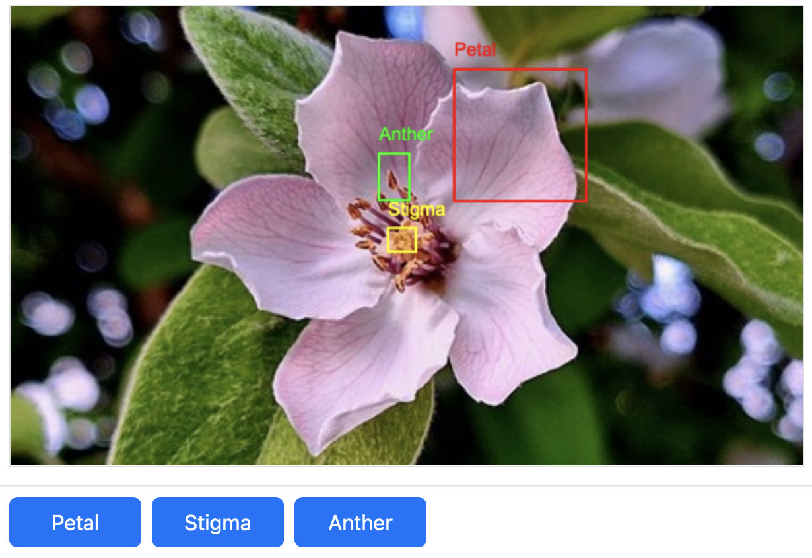

# PrairieLearn OER Element: Image Annotation

This element was developed by Willi Chang and Patrick Wu. Please carefully test the element and understand its features and limitations before deploying it in a course. It is provided as-is and not officially maintained by PrairieLearn, so we can only provide limited support for any issues you encounter!

If you like this element, you can use it in your own PrairieLearn course by copying the contents of the `elements` folder into your own course repository. After syncing, the element can be used as illustrated by the example question that is also contained in this repository.

## `pl-image-annotate` Element

This element allows students to upload images and mark areas with pre-defined, rectangular annotations. Annotated images can be graded manually, or processed by an external auto-grader (not included in this repository) to add features such as OCR or other image recognition.

### Example



```html
<pl-image-annotate answer-name="solution" width="500">
  <pl-rectangle-annotate
    label="Destination MAC"
    key="destination_mac"
    color="#FF0000"
    width="200"
    height="100"
    resizable="True"
    font-size="16"
    border-width="3"
  ></pl-rectangle-annotate>
</pl-image-annotate>
```

### Element Attributes

| Attribute      | Type | Description                                  
|----------------|-------------------------------------------------
| `answer-name`  | string (required) |  Unique identifier for the annotation instance   
| `width`        | integer (default: `500`) | Width of the annotated image container in pixels
| `height`       | integer (default: `100`) | Default height of the annotated image container in pixels; will be adjusted based on the aspect ratio of the uploaded image 


#### Sub-Element: `pl-rectangle-annotate`

Each `pl-rectangle-annotate` element nested inside `pl-image-annotate` defines an annotation type. Each type can be customized with attributes for color, default dimensions, resizability, and a text label that is displayed next to the annotation.

### Attributes

| Attribute       | Type | Description          
|-----------------|------|-----------------------------------------------
| `key`           | string (required) |  Unique key for the annotation type (can be used for auto-grading; see below)    
| `label`         | string (required) |  Label for the annotation type that is displayed next to the annotation rectangle    
| `required`      | boolean (default: `false`) | If set to `true`, the annotation type is required and student submissions are marked as invalid if the annotation is missing
| `color`         | string (default: `red`) | Rectangle color (hex or color name)         
| `width`         | integer (default: `100`) | Default annotation rectangle width in pixels                        
| `height`        | integer (default: `100`) | Default annotation rectangle height in pixels    
| `resizable`     | boolean (default: `true`) | If set to `true`, the rectangle can be resized of students       
| `font-size`     | integer (default: `14`) | Font size for the label that is displayed next to the annotation rectangle   
| `border-width`  | integer (default: `2`) | Border width for the annotation rectangle   


### Image Processing for Auto-grading Annotations

The element stores all submitted annotations in data['submitted_answer'] in a base64 format, which allows access to both the full image and individual annotations. The following code illustrates how to access the data in a `server.py` script:

```python
import json

def parse(data):
    # Because the data is json object, we need to parse it first
    annotation_data = json.loads(data["submitted_answers"]["solution"])

    # Access whole uploaded image
    canvas = annotation_data["canvas"]

    # Access individual annotations by key (as a cropped image)
    destination_mac = annotation_data["annotations"]["destination_mac"]
```

**Exporting the Annotated Image**

The following example shows how the base64 format can be converted into a file to be saved and processed with external tools:

```python
import json
import base64

def parse(data):
	answer_name = "test"
	annotation_data = json.loads(data["submitted_answers"][answer_name])
	for key, value in annotation_data["annotations"].items():
		image_data = base64.b64decode(value)
		with open(key + '.jpg', 'wb') as f:
			f.write(image_data)
```

**Integration with OCR for Grading**

The following script illustrates how to integrate Optical Character Recognition (OCR) to extract text from the saved annotation images for automated grading:

```python
import json
import base64
import pyocr
import pyocr.builders
from PIL import Image

def parse(data):
	answer_name = "test"
	annotation_data = json.loads(data["submitted_answers"][answer_name])
	for key, value in annotation_data["annotations"].items():
		image_data = base64.b64decode(value)
		with open(key + '.jpg', 'wb') as f:
			f.write(image_data)

		# Initialize OCR tool
		tools = pyocr.get_available_tools()
		if tools:
			tool = tools[0]
			text = tool.image_to_string(
				Image.open(key + '.jpg'),
				lang='eng',
				builder=pyocr.builders.TextBuilder()
			)
      # Replace printing with further grading steps
			print(text)
		else:
			print("No OCR tool found")
```